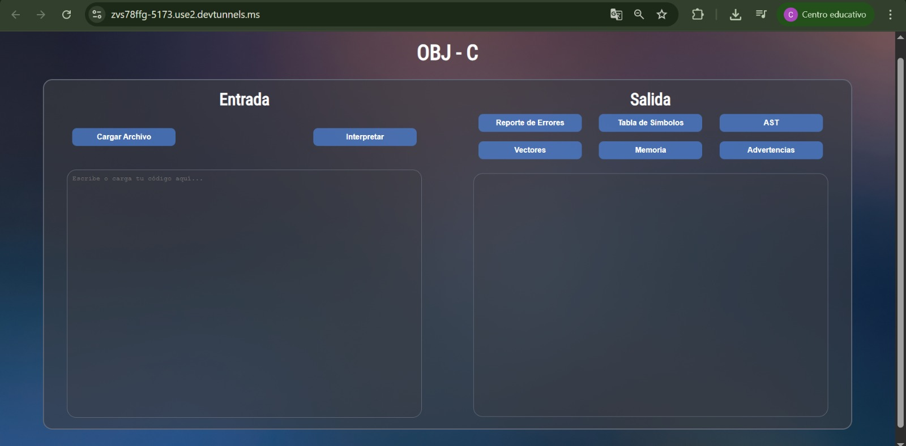
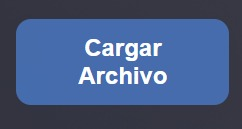
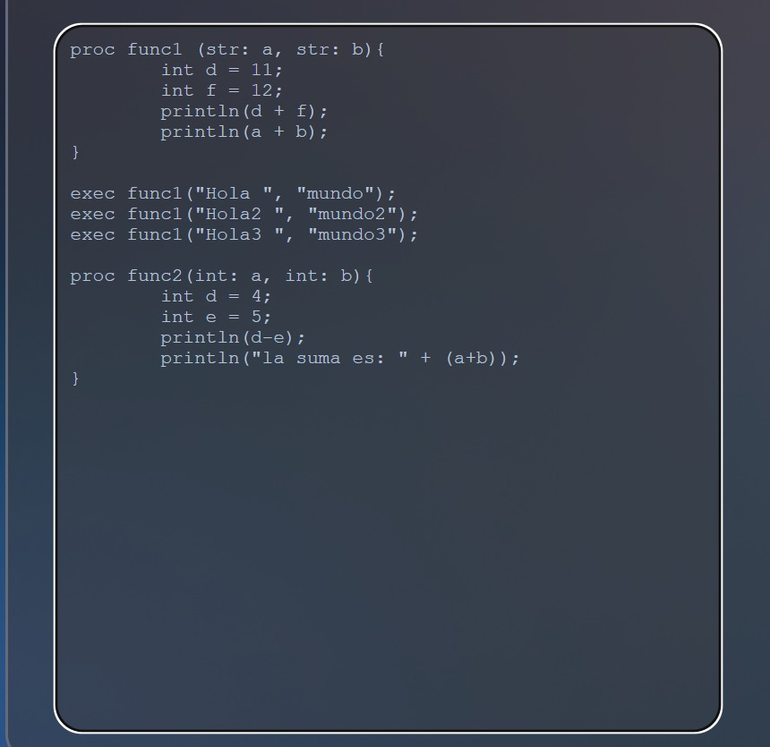
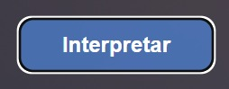
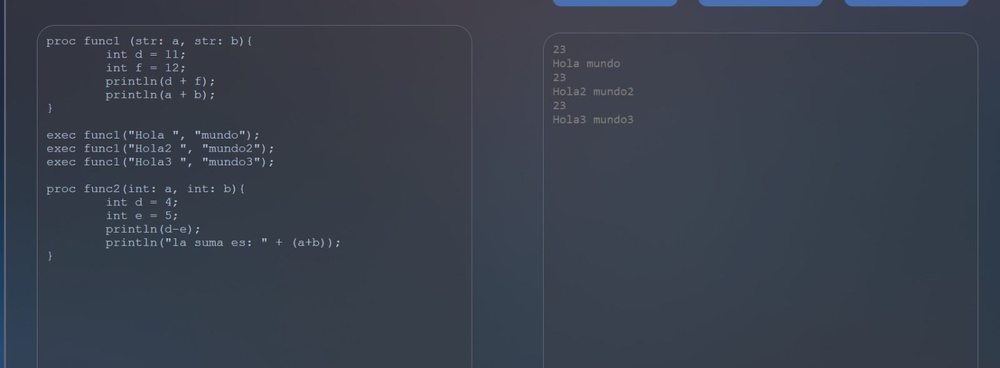
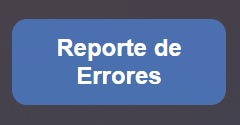
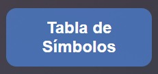
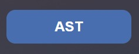
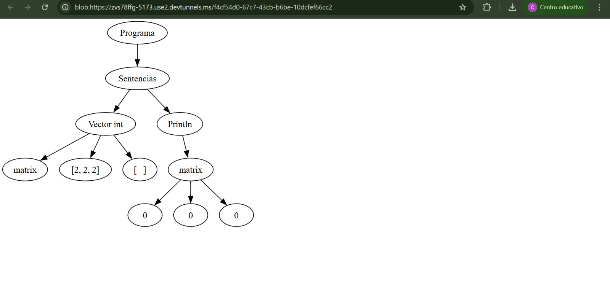
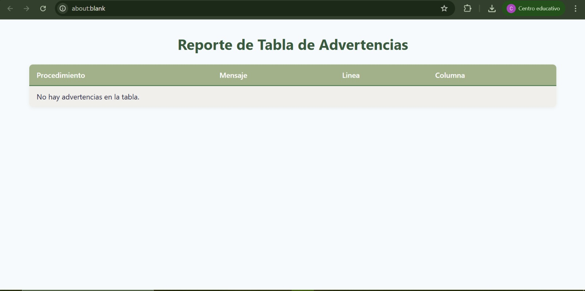

# Manual de Usuario  
## Proyecto - Lenguaje OBJ-C  
**Curso:** Organización de Lenguajes y Compiladores 1  
**Sección P**  
**Universidad de San Carlos de Guatemala**   

**Integrantes:**  
- Eduardo Sebastián Gutiérrez de Felipe 
- Carlos Eduardo Lau López
- Sebastián Antonio Romero Tzitizmit
- Christian David Chinchilla Santos

---

## Índice

1. [Introducción](#introducción)  
2. [Requisitos del Sistema](#requisitos-del-sistema)  
3. [Pantalla Principal](#pantalla-principal)  
4. [Cargar Código Fuente](#cargar-código-fuente)  
5. [Interpretar Código](#interpretar-código)  
6. [Visualización de Reportes](#visualización-de-reportes)  
    1. [Reporte de Errores](#reporte-de-errores)  
    2. [Tabla de Símbolos](#tabla-de-símbolos)  
    3. [AST (Árbol de Sintaxis Abstracta)](#ast-árbol-de-sintaxis-abstracta)  
    4. [Vectores](#vectores)  
    5. [Memoria](#memoria)  
    6. [Advertencias](#advertencias)  

---

## Introducción

El presente manual de usuario describe el funcionamiento de la aplicación desarrollada para el Proyecto, correspondiente al lenguaje **OBJ-C**, como parte del curso **Organización de Lenguajes y Compiladores 1**.  

La herramienta permite cargar, interpretar y analizar código fuente en OBJ-C, proporcionando reportes útiles para su depuración y entendimiento.  

A través de una interfaz web amigable, el usuario puede interactuar con la aplicación, interpretar código y visualizar los resultados, así como los diferentes reportes generados automáticamente.

---

## Requisitos del Sistema

Para el correcto funcionamiento de la aplicación, se recomienda contar con:  

- Un navegador web moderno (Google Chrome, Mozilla Firefox o Microsoft Edge)  
- Acceso a internet para comunicación con el backend  
- Python 3.x instalado en el servidor  
- Librerías requeridas: `PLY`, `Flask`, `Graphviz`, entre otras  
- Sistema operativo compatible: Windows 10/11, Linux o MacOS  

---

## Pantalla Principal

Al ingresar a la aplicación, se presenta una pantalla principal que contiene los siguientes elementos:

- **Barra de menú superior:** contiene el título del proyecto “OBJ - C”.

- **Sección de Entrada (lado izquierdo):**
    - **Botón “Cargar Archivo”**: permite cargar un archivo de código fuente con extensión `.objc` desde el equipo del usuario.
    - **Botón “Interpretar”**: ejecuta el análisis e interpretación del código que se encuentra en el área de edición.
    - **Área de edición**: un cuadro de texto donde el usuario puede escribir directamente el código en lenguaje OBJ-C, o visualizar el contenido de un archivo cargado.

- **Sección de Salida (lado derecho):**
    - **Botón “Reporte de Errores”**: genera y muestra una tabla con los errores encontrados durante el análisis del código.
    - **Botón “Tabla de Símbolos”**: genera y muestra la tabla de símbolos, que contiene las variables y funciones declaradas.
    - **Botón “AST”**: genera y muestra el Árbol de Sintaxis Abstracta del código.
    - **Botón “Vectores”**: muestra el contenido y estado de los vectores declarados en el código.
    - **Botón “Memoria”**: muestra el estado actual de la memoria, incluyendo variables y sus valores.
    - **Botón “Advertencias”**: muestra una lista de advertencias que pueden ayudar a mejorar la calidad del código.

- **Consola de salida**: área en la parte inferior donde se muestra el resultado de la ejecución del código, así como mensajes del sistema (por ejemplo, la cantidad de errores encontrados).

 

---

## Cargar Código Fuente

La opción **Cargar Archivo** permite al usuario importar un archivo de código fuente con extensión `.objc`.  

Pasos para utilizar esta función:  
1. Hacer clic en el botón **Cargar Archivo**.  
2. Seleccionar un archivo válido desde el explorador del sistema.  
3. El código se cargará automáticamente en el área de edición, reemplazando cualquier contenido previo.  

Esta función facilita trabajar con archivos existentes y probar distintos códigos en el lenguaje OBJ-C.  

---

## Interpretar Código

El botón **Interpretar** ejecuta el proceso de análisis y ejecución del código presente en el editor.  

Al hacer clic en este botón:  
1. El código es enviado al backend 
2. Se realiza el análisis léxico, sintáctico y semántico.  
3. Si el código es correcto, se muestra la salida en la consola.  
4. Si se detectan errores, se muestra la cantidad de errores encontrados.  

El usuario puede corregir el código y volver a interpretar cuantas veces sea necesario.

---

## Visualización de Reportes

Una de las funcionalidades más importantes de la aplicación es la generación automática de reportes, que permiten comprender el estado del código analizado.

Cada reporte puede ser consultado desde la interfaz gráfica tras interpretar el código.

---

### Reporte de Errores

Este reporte muestra todos los errores encontrados durante la fase de análisis.  

Tipos de errores:  
- **Léxicos**  
- **Sintácticos**  
- **Semánticos**  

La tabla de errores incluye información como:  
- Tipo de error  
- Descripción  
- Línea y columna donde ocurrió

---

### Tabla de Símbolos

Muestra una tabla con todas las variables y funciones declaradas en el código, con la siguiente información:  
- Identificador  
- Tipo de dato  
- Contexto o entorno  
- Valor actual  
- Línea y columna de declaración  

Este reporte es muy útil para depurar errores semánticos o de lógica.

---

### AST (Árbol de Sintaxis Abstracta)

La herramienta genera y visualiza el **Árbol de Sintaxis Abstracta (AST)** del código analizado.  

El AST muestra gráficamente la estructura del código, facilitando el análisis de la construcción sintáctica y lógica de los programas.

---

### Vectores

Si el código fuente declara o manipula vectores (arreglos), la herramienta muestra un reporte detallando el contenido y estado de cada vector.

Esto es útil para visualizar las operaciones con estructuras de datos.

---

### Memoria

Este reporte muestra el estado actual de la memoria, incluyendo variables activas y sus valores.  

Permite verificar el comportamiento en tiempo de ejecución y el uso de variables.

---

### Advertencias

Además de los errores críticos, la herramienta también reporta advertencias sobre el código, como:  
- Variables declaradas pero no utilizadas  
- Estructuras innecesarias  
- Posibles inconsistencias  

Estas advertencias ayudan a mejorar la calidad del código.

---
